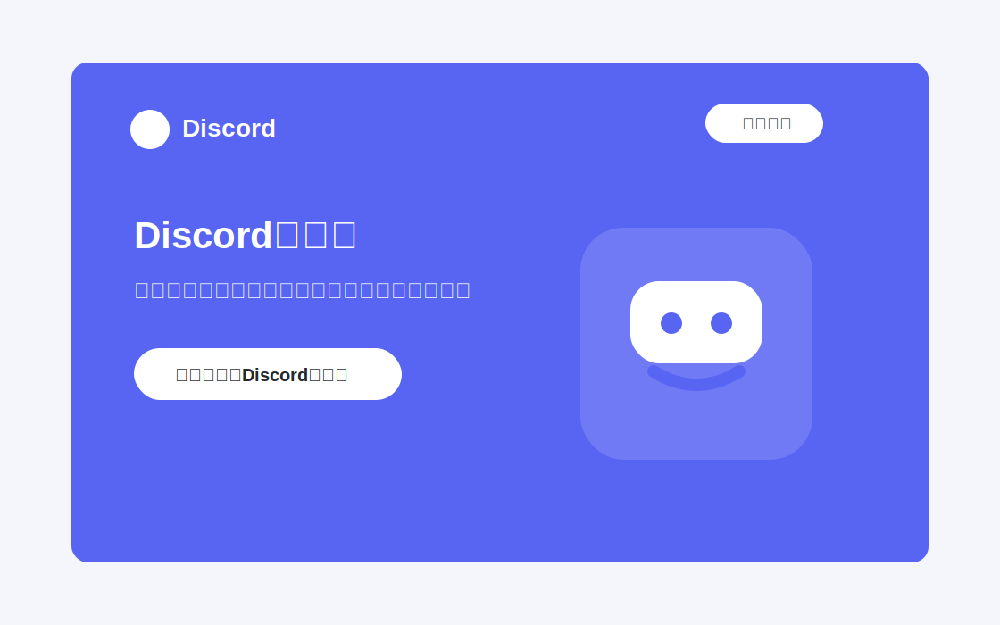
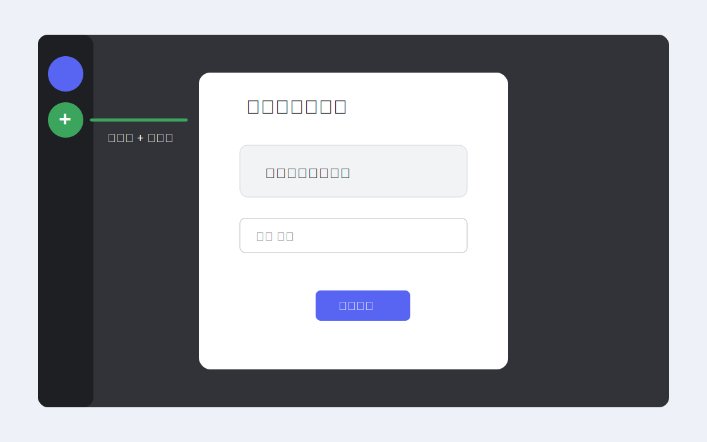
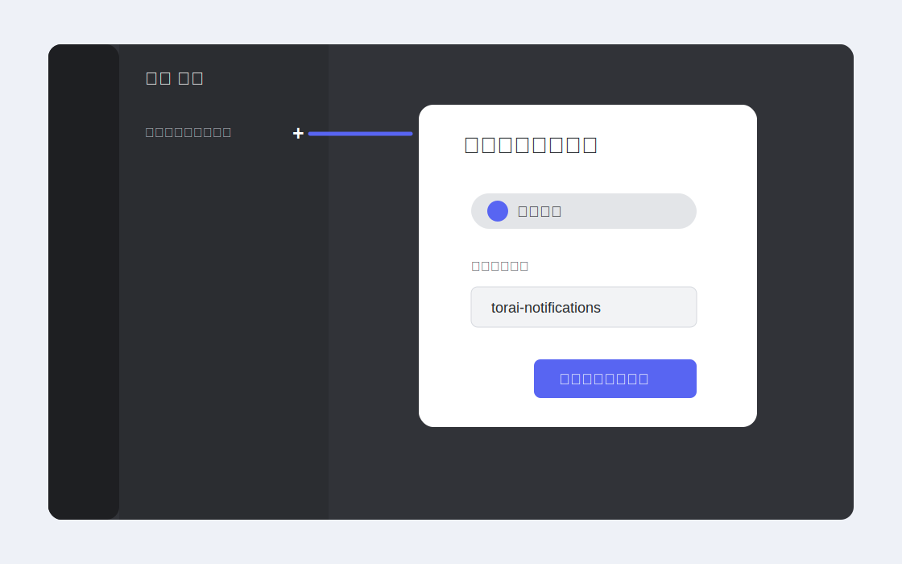
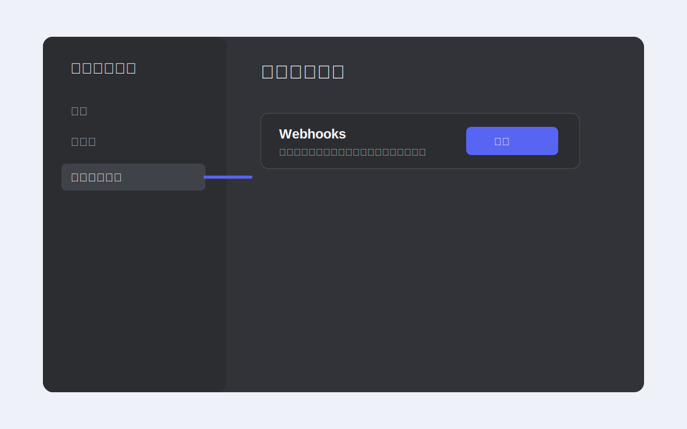
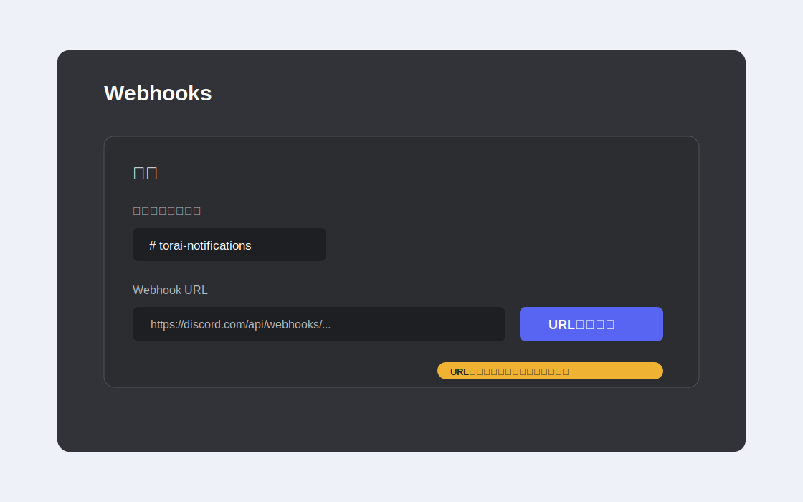
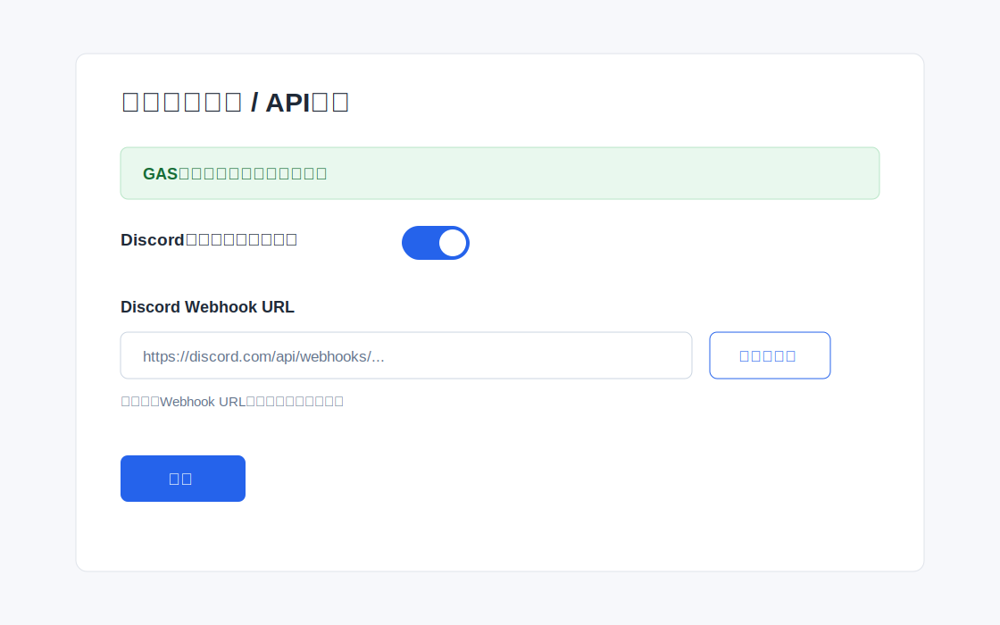
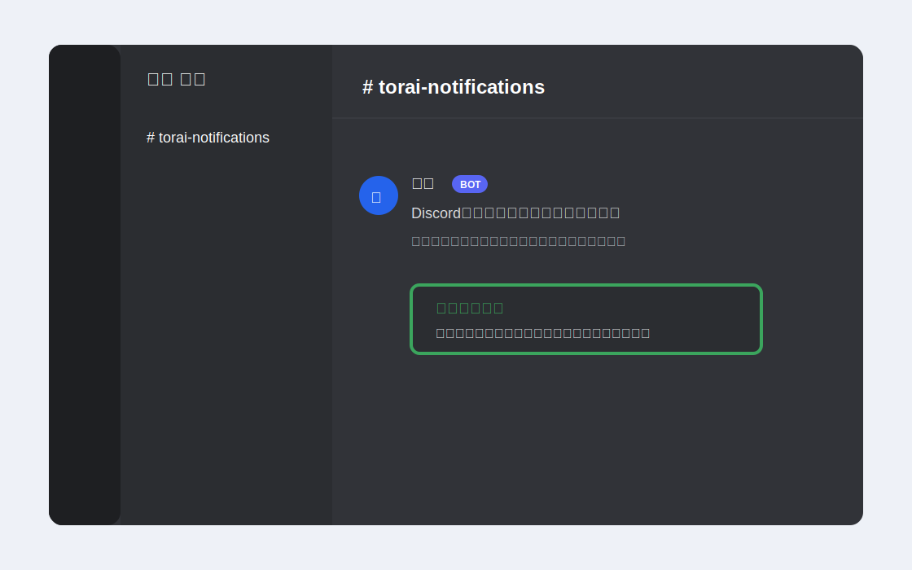
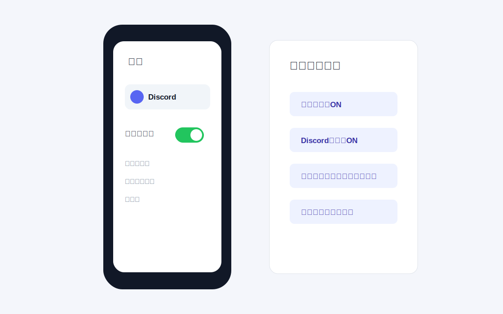

# Discord通知の設定マニュアル

このマニュアルでは、Discordアカウントを作成して、虎威のX自動投稿結果をDiscordで受け取るまでの手順を説明します。

作業はPCブラウザまたはDiscordデスクトップアプリで行うと確実です。スマートフォンだけでも通知確認はできますが、Webhook URLの作成はPCで行うことをおすすめします。

## 事前に用意するもの

- メールアドレス
- スマートフォン
- PCブラウザ、またはDiscordデスクトップアプリ
- 虎威にログインできるアカウント
- 虎威の `プロフィール` > `APIキー` でGAS本人確認が完了している状態

## 全体の流れ

1. Discordアカウントを作成する
2. 通知を受け取るDiscordサーバーを作成する
3. 通知用チャンネルを作成する
4. DiscordでWebhook URLをコピーする
5. 虎威にWebhook URLを設定する
6. テスト送信でメッセージ受信を確認する
7. スマートフォン通知を確認する

## 1. Discordアカウントを作成する

1. ブラウザで [Discord](https://discord.com/) を開きます。
2. `ログイン` または `Open Discord in your browser` を押します。
3. アカウント作成画面で、メールアドレス、表示名、ユーザー名、パスワード、生年月日を入力します。
4. Discordから届く確認メールを開き、メールアドレスを認証します。
5. Discordにログインできることを確認します。



## 2. 通知受信用サーバーを作成する

1. Discord画面左側の `+` ボタンを押します。
2. `オリジナルの作成` を選びます。
3. 用途を聞かれた場合は、どちらを選んでも構いません。
4. サーバー名を入力します。
   例: `虎威 通知`
5. `新規作成` を押します。



すでに自分専用の通知サーバーがある場合は、新しく作らず既存サーバーを使っても構いません。

## 3. 通知受信用チャンネルを作成する

1. 作成したサーバーを開きます。
2. テキストチャンネル一覧の横にある `+` を押します。
3. チャンネル種類は `テキスト` を選びます。
4. チャンネル名を入力します。
   例: `torai-notifications`
5. `チャンネルを作成` を押します。



すでにある `general` などのテキストチャンネルを使っても構いません。ただし、虎威の通知だけを見分けやすくしたい場合は、専用チャンネルを作ることをおすすめします。

## 4. DiscordでWebhook URLをコピーする

1. Discordで通知を受けたいサーバーを開きます。
2. サーバー名の横にある下向きメニューを開きます。
3. `サーバー設定` を開きます。
4. 左メニューの `連携サービス` または `Integrations` を開きます。
5. `ウェブフック` または `Webhooks` を開きます。
6. `新しいウェブフック` または `Create Webhook` を押します。



7. Webhook名を入力します。
   例: `虎威`
8. 投稿先チャンネルに、手順3で作成した通知用チャンネルを選びます。
9. `Webhook URLをコピー` または `Copy Webhook URL` を押します。



コピーしたURLは、次のような形式です。

```text
https://discord.com/api/webhooks/123456789012345678/xxxxxxxxxxxxxxxxxxxxxxxx
```

GitHub連携用の説明で見かける `/github` は、虎威では付けません。

## 5. 虎威にWebhook URLを設定する

1. 虎威にログインします。
2. `プロフィール` を開きます。
3. `APIキー` 画面を開きます。
4. `GAS本人確認は完了済みです。` と表示されていることを確認します。
5. `Discordにポスト結果を送信` をONにします。
6. `Discord Webhook URL` に、手順4でコピーしたURLを貼り付けます。
7. `テスト送信` を押します。



テスト送信が成功したら、Discordの通知用チャンネルを確認します。問題なければ虎威の画面で `保存` を押します。

Webhook URLは保存後、虎威の画面には再表示されません。変更したい場合は、DiscordでWebhook URLをコピーし直して、虎威に新しいURLを入力してください。

## 6. Discordでテストメッセージを確認する

1. Discordで通知用チャンネルを開きます。
2. 虎威からのテストメッセージが表示されていることを確認します。
3. メッセージが表示されていれば、Webhook URLは正しく動作しています。



スマートフォンにプッシュ通知が届かない場合でも、Discordチャンネルにメッセージが表示されていればWebhook URL自体は正しく設定できています。その場合は、スマートフォン側やDiscord側の通知設定を確認してください。

## 7. スマートフォンでDiscord通知を受け取る

### 7.1 Discordアプリをインストールする

1. iPhoneの場合はApp Store、Androidの場合はGoogle Playを開きます。
2. `Discord` を検索してインストールします。
3. 手順1で作成したDiscordアカウントでログインします。

### 7.2 スマートフォン本体の通知を許可する

iPhoneの場合:

1. iPhoneの `設定` を開きます。
2. `通知` を開きます。
3. `Discord` を選びます。
4. `通知を許可` をONにします。
5. ロック画面、通知センター、バナーの表示を必要に応じてONにします。

Androidの場合:

1. Androidの `設定` を開きます。
2. `通知` または `アプリ` を開きます。
3. `Discord` を選びます。
4. 通知をONにします。
5. バッテリー最適化や省電力設定でDiscordの通知が止められていないか確認します。



### 7.3 Discord側の通知設定を確認する

1. スマートフォンでDiscordアプリを開きます。
2. 通知用サーバーを開きます。
3. 通知用チャンネルを開きます。
4. サーバーまたはチャンネルの通知設定を開きます。
5. 通知をミュートしていないことを確認します。
6. Webhookの投稿でも通知を受けたい場合は、通知対象を `すべてのメッセージ` にします。

虎威の通知メッセージは通常のチャンネル投稿として届きます。メンション通知だけにしている場合、スマートフォンへ通知されないことがあります。

## 8. 動作確認チェックリスト

- 虎威の `プロフィール` > `APIキー` で `Discordにポスト結果を送信` がONになっている
- `Discord Webhook URL` にDiscordでコピーしたURLを貼り付けた
- 虎威の `テスト送信` でエラーが出ていない
- Discordの通知用チャンネルにテストメッセージが表示されている
- スマートフォンにもプッシュ通知が届く

スマートフォンに通知が届かない場合でも、Discordチャンネルにメッセージが表示されていれば、虎威からDiscordへの送信は成功しています。スマートフォン本体、Discordアプリ、サーバー、チャンネルの通知設定を順番に確認してください。

## 9. 通知が届かない場合の確認項目

- 虎威のテスト送信でエラーが出ていないか
- Discordチャンネルにテストメッセージが表示されているか
- Webhook URLを途中で削除、再生成していないか
- Discordのサーバーまたはチャンネルをミュートしていないか
- Discordの通知対象が `すべてのメッセージ` になっているか
- スマートフォン本体でDiscordの通知が許可されているか
- スマートフォンが集中モード、おやすみモード、省電力モードになっていないか
- Discordアプリで同じアカウントにログインしているか

## 10. Webhook URLの取り扱い注意

Webhook URLを知っている人は、そのDiscordチャンネルへメッセージを送信できます。

- Webhook URLをSNSや公開ページに貼らないでください。
- 他人に共有しないでください。
- スクリーンショットを共有する場合は、Webhook URLが写らないようにしてください。
- 漏えいした可能性がある場合は、DiscordでWebhookを削除し、新しいWebhook URLを作成してください。
- 使わなくなったWebhookはDiscordの `サーバー設定` > `連携サービス` > `Webhooks` から削除してください。

## 参考

- [Discord Beginner's Guide](https://support.discord.com/hc/en-us/articles/360045138571-Beginner-s-Guide-to-Discord)
- [Discord Intro to Webhooks](https://support.discord.com/hc/en-us/articles/228383668-Intro-to-Webhooks)
- [Discord Notifications Settings 101](https://support.discord.com/hc/en-us/articles/215253258-Notifications-Settings-101)
