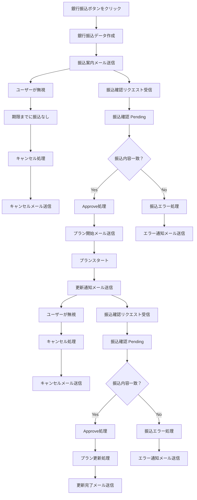

```mermaid
graph TD
  A[銀行振込ボタンをクリック] --> B[銀行振込データ作成]
  B --> C[振込案内メール送信]

  C --> D1[ユーザーが無視]
  D1 --> E1[期限までに振込なし]
  E1 --> F1[キャンセル処理]
  F1 --> G1[キャンセルメール送信]

  C --> D2[振込確認リクエスト受信]
  D2 --> E2[振込確認 Pending]
  E2 --> F2{振込内容一致？}
  F2 -->|Yes| G2[Approve処理]
  G2 --> H2[プラン開始メール送信]
  H2 --> I2[プランスタート]
  F2 -->|No| G3[振込エラー処理]
  G3 --> H3[エラー通知メール送信]


  %% 更新フロー
  I2 --> U1[更新通知メール送信]
  U1 --> U2[ユーザーが無視]
  U2 --> U3[キャンセル処理]
  U3 --> U4[キャンセルメール送信]

  U1 --> U5[振込確認リクエスト受信]
  U5 --> U6[振込確認 Pending]
  U6 --> U7{振込内容一致？}
  U7 -->|Yes| U8[Approve処理]
  U8 --> U9[プラン更新処理]
  U9 --> U10[更新完了メール送信]
  U7 -->|No| U11[振込エラー処理]
  U11 --> U12[エラー通知メール送信]

```
